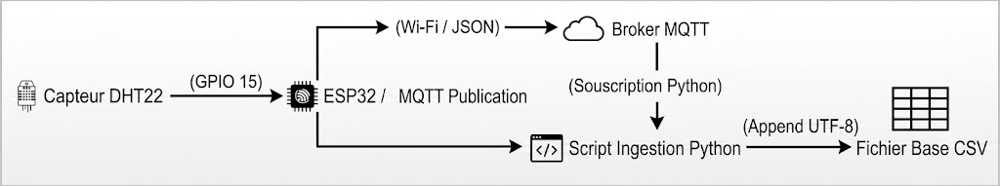

# Executive Summary : AirCarePlus IoT Platform

Ce document synthétise l'architecture technique de la solution AirCarePlus (Mois 1), conçue pour l'acquisition robuste et sécurisée de données environnementales en entreprise.

## 1. Matériel (Hardware)

L'infrastructure de captation (Edge) repose sur des composants garantissant un équilibre optimal entre coût, précision et connectivité.

* **Unité de traitement :** Microcontrôleur **ESP32** (émulé sur Wokwi), sélectionné pour sa connectivité Wi-Fi 2.4 GHz native et sa fiabilité en environnement IoT.
* **Capteur Environnemental :** Sonde numérique **DHT22** (AM2302) connectée via GPIO 15. Elle assure des mesures de haute précision : $\pm 0.5^\circ\text{C}$ pour la température et $\pm 2\%\text{ RH}$ pour l'humidité, répondant aux standards de surveillance des espaces de travail.

## 2. Micrologiciel (Firmware)

Le code embarqué (C++) est optimisé pour garantir une haute disponibilité et prévenir les défaillances matérielles ou réseaux.

* **Exécution Asynchrone :** L'échantillonnage temporel est géré de manière non-bloquante, maintenant l'ESP32 réactif aux interruptions réseaux sans figer le processeur.
* **Standardisation des Payloads :** Sérialisation des relevés au format **JSON**, assurant une structure de données légère, évolutive et indépendante des capteurs ajoutés ultérieurement.
* **Tolérance aux Pannes (Fail-Safe) :**
  * *Auto-reconnexion autonome* et non-bloquante aux réseaux Wi-Fi et MQTT.
  * *Watchdog Timer (WDT) matériel* configuré à 10 secondes, imposant un redémarrage physique automatique en cas de gel d'exécution critique.

## 3. Flux de Données (Data Flow)

Le pipeline réseau repose sur un couplage faible, assurant l'intégrité de la donnée de la captation physique jusqu'à sa persistance.

* **Transport MQTT :** Transmission sécurisée des objets JSON sur un serveur **Eclipse Mosquitto** local (port 1883) via le topic dédié `aircare/sensors`.
* **Ingestion Applicative :** Un service **Python** (`paho-mqtt`) écoute en continu le flux, intégrant une gestion des exceptions pour ignorer les paquets corrompus sans interruption de service.
* **Persistance Sécurisée :** Les données validées sont enrichies d'un horodatage système, puis écrites en mode d'ajout continu (*Append*) dans un fichier plat structuré (`data/sensor_data.csv`).