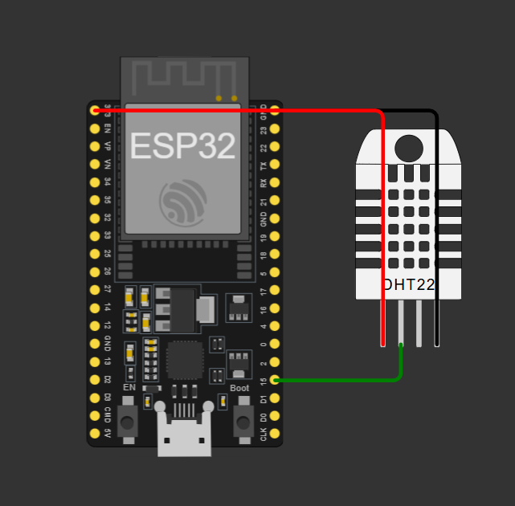

# Documentation du Câblage Matériel 

Ce document détaille le schéma d'interconnexion entre le microcontrôleur ESP32 et le capteur DHT22 pour le projet **AirCare+**.

## 1. Capture du Circuit Virtuel (Photo / Rendu Wokwi)

Voici le montage complet et fonctionnel simulé dans l'environnement Wokwi :

---

##  2. Tableau de Brochage (Pinout)

| Composant Source (DHT22) | Fonction du Signal | Broche Cible (ESP32) | Couleur de Câble |
| :--- | :--- | :--- | :--- |
| **VCC** | Alimentation positive (+3.3V) | **3V3** | Rouge 🔴 |
| **SDA / DATA** | Ligne de données série | **GPIO 15** | Vert 🟢 |
| **GND** | Masse Commune (0V) | **GND** | Noir ⚫ |

